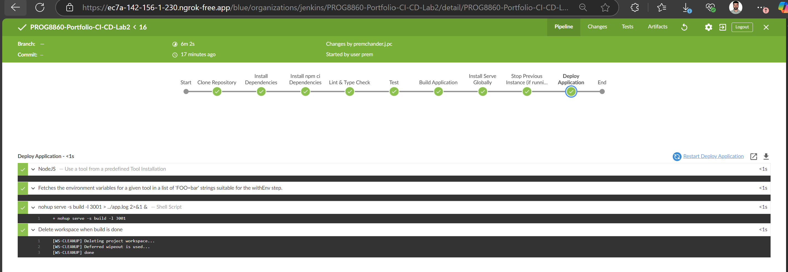

## Prem Chander Jebastian - Porfolio ###

# PROG8860 Portfolio CI/CD Pipeline

This project demonstrates the integration of GitHub and Jenkins for CI/CD automation of a Next.js-based portfolio project.

## File Structure

/PROG8860-S25-CICD
├── Jenkinsfile               # Jenkins pipeline script
├── PremChanderJ-Portfolio    # Next.js app root folder
│   ├── pages                 # Next.js pages
│   ├── public                # Static assets
│   ├── styles                # CSS/SCSS files
│   ├── package.json          # NPM dependencies and scripts
│   ├── next.config.js        # Next.js configuration
│   └── ...
├── README.md                 # This file
├── .gitignore
└── ...

## Prerequisites
Jenkins installed (v2.0+ recommended)

Git installed on Jenkins server

Node.js (v16 or above) installed on Jenkins server

NPM or Yarn available on Jenkins server

Jenkins plugins: Git Plugin, Pipeline Plugin

Access to this GitHub repository

Port 3001 available for local app deployment testing (modifiable in Jenkinsfile) 

## Technologies Used

- Next.js (Frontend)
- Node.js
- TypeScript
- ESLint
- Jenkins (CI/CD automation)
- GitHub (Version Control)

## CI/CD Workflow Overview

1. **Source Code Management:**  
   Code is maintained on GitHub repository [`https://github.com/jpremchander/PROG8860-S25-CICD`](https://github.com/jpremchander/PROG8860-S25-CICD).

2. **Integration with Jenkins:**  
   Jenkins is connected to GitHub using a **Webhook** for real-time triggering of builds whenever changes are pushed.

3. **Pipeline Stages:**
    - Clone Repository
    - Install Dependencies (`npm ci`)
    - Lint & Type Check (`npm run lint`)
    - Unit Testing
    - Build Application (`next build`)
    - Deployment (local or server deployment using `serve`)

4. **Branch Used for CI/CD:**  
   The Jenkins pipeline is configured to track the `lab2` branch.

## Triggering the Pipeline

- The pipeline is triggered automatically when any new commits are pushed to the repository.
- This is achieved using a GitHub Webhook integrated with Jenkins.

## Pipeline Configuration

- Declarative Jenkinsfile located inside `PremChanderJ-Portfolio` directory.
- Credentials are securely managed in Jenkins.
- Build logs are stored within Jenkins for audit and debugging purposes.

## Webhook vs Polling

| Aspect      | Webhook  | Polling |
|-------------|----------|---------|
| Trigger Type | Real-time | Scheduled |
| Load on Server | Low | High (continuous API checks) |
| Network Usage | Efficient | Inefficient |
| Speed | Immediate | Delayed based on polling interval |
| Setup Complexity | Requires initial webhook setup | Simple (only Jenkins configuration) |
| Reliability | Requires stable webhook delivery | Reliable but slow |

In this project, **Webhook approach** was chosen for efficient and real-time build triggering.

## Jenkins Build - Stage View

## localhost: Portfolio

## Author

Prem Chander J
