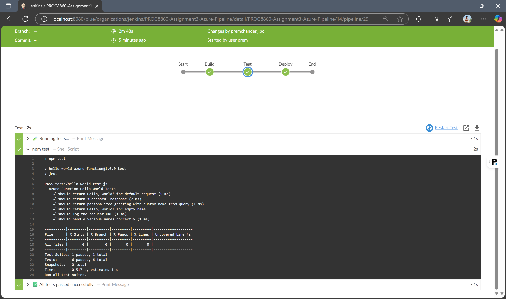
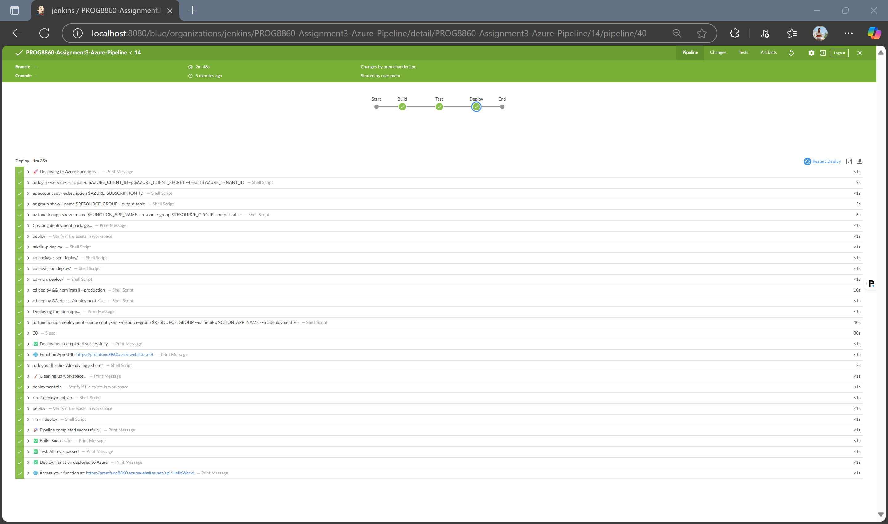
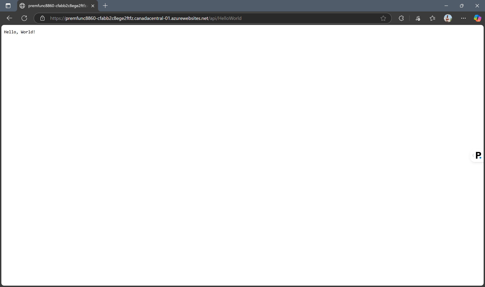
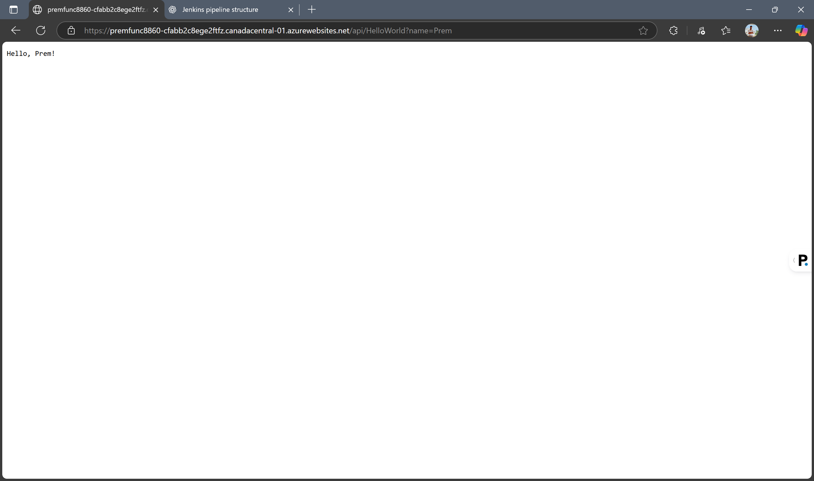

PROG8860 Assignment 3 - Jenkins CI/CD Pipeline for Azure Functions

Student Name: Prem Chander J
Student ID: 9015480
Course: PROG8860-S25-CICD
Assignment: Assignment 3 - Jenkins CI/CD Pipeline for Azure Function

📋 Project Overview

This project demonstrates a complete Jenkins CI/CD pipeline that automatically builds, tests, and deploys an Azure Functions application. The pipeline integrates with GitHub for source code management and deploys to Microsoft Azure.

🎯 Assignment Objectives Met
✅ Build, Test, and Deploy stages functioning correctly

✅ At least 3 comprehensive test cases (6 test cases implemented)

✅ Azure Functions integration

✅ Automated CI/CD pipeline with Jenkins

✅ GitHub repository integration

🏗️ Architecture Overview

GitHub Repository → Jenkins Pipeline → Azure Functions  
     ↓                    ↓                 ↓  
Source Code         Build → Test →      Deployed  
Management           Deploy Stages      Application  
💻 Technology Stack
Runtime: Node.js 18

Cloud Platform: Microsoft Azure Functions v4

CI/CD Tool: Jenkins

Testing Framework: Jest

Source Control: GitHub

Authentication: Azure Service Principal

🚀 Azure Function Details
Function Specifications
Function Name: HelloWorld

HTTP Methods: GET, POST

Authentication: Anonymous

Runtime: Node.js 18

Azure Functions Version: v4 (Latest)

Azure Resources

Resource Group: premfunc8860_group

Function App: premfunc8860

Region: Central Canada

Function Endpoints

Base URL:
https://premfunc8860-cfabb2c8ege2ftfz.canadacentral-01.azurewebsites.net/api/HelloWorld

With Parameter:
https://premfunc8860-cfabb2c8ege2ftfz.canadacentral-01.azurewebsites.net/api/HelloWorld?name=YourName

🧪 Testing Strategy

Test Coverage
The application includes 6 comprehensive test cases covering:

Basic Functionality Test – Validates default "Hello, World!" response

HTTP Response Validation – Ensures successful response structure

Query Parameter Handling – Tests custom name parameter functionality

Edge Case Testing – Handles empty name parameters

Logging Verification – Confirms proper request logging

Multiple Name Scenarios – Tests various input combinations

Test Results

✅ Test Suites: 1 passed, 1 total  
✅ Tests: 6 passed, 6 total  
✅ Snapshots: 0 total  
⏱️ Time: ~0.8s  

🔄 Jenkins CI/CD Pipeline

Pipeline Stages

1. Build Stage 🔧
Cleans previous build artifacts

Installs npm dependencies

Prepares the application for testing

2. Test Stage 🧪
Executes Jest test suite

Validates all 6 test cases

Ensures code quality before deployment

3. Deploy Stage 🚀
Authenticates with Azure using Service Principal

Creates/verifies Azure resources

Packages application for deployment

Deploys to Azure Functions using ZIP deployment

Configures app settings

Pipeline Features:

Automated Triggers: GitHub webhook integration

Environment Management: Secure credential storage

Error Handling: Comprehensive error catching and reporting

Cleanup: Post-deployment artifact cleanup

Cross-Platform: Works with Linux Jenkins agents

🌐 Live Application

Deployment Verification
The function is deployed and accessible at:

Testing the Live Function

Basic Request:

GET https://premfunc8860-cfabb2c8ege2ftfz.canadacentral-01.azurewebsites.net/api/HelloWorld
Response: Hello, World!
With Custom Name:

GET https://premfunc8860-cfabb2c8ege2ftfz.canadacentral-01.azurewebsites.net/api/HelloWorld?name=Prem

Response: Hello, Prem!

📁 Project Structure

PROG8860-S25-CICD/
├── src/
│   └── functions/
│       └── HelloWorld.js          # Azure Function implementation
├── tests/
│   └── hello-world.test.js        # Jest test suite (6 test cases)
├── screenshots/                   # Pipeline and deployment screenshots
│   ├── build.png
│   ├── test.png
│   ├── deploy.png
│   └── sample-app.png
├── Jenkinsfile                    # Jenkins pipeline configuration
├── package.json                   # Node.js dependencies and scripts
├── host.json                      # Azure Functions configuration
├── jest.config.js                 # Jest testing configuration
└── README.md                      # This documentation

⚙️ Setup and Configuration

Prerequisites

Jenkins server with Azure CLI

Azure subscription and service principal

GitHub repository access

Node.js 18+ runtime

Jenkins Credentials Required
azure-subscription-id

azure-tenant-id

azure-client-id

azure-client-secret

Local Development

# Clone repository
git clone https://github.com/jpremchander/PROG8860-S25-CICD.git

# Install dependencies
npm install

# Run tests
npm test

# Run locally (requires Azure Functions Core Tools)
func start
✅ Assignment Requirements Fulfillment

Requirement	Status	Implementation

Build Stage	✅ Complete	Automated npm install and prep steps

Test Stage	✅ Complete	6 comprehensive test cases using Jest

Deploy Stage	✅ Complete	Deploys using Azure CLI and ZIP method

Minimum 3 Tests	✅ Exceeded	Total of 6 test cases implemented

Functioning Pipeline	✅ Complete	End-to-end CI/CD using Jenkins

**********************************************************************
Student: Prem Chander J
Student ID: 9015480
GitHub: jpremchander
Repository: PROG8860-S25-CICD
Branch: assignment-3

