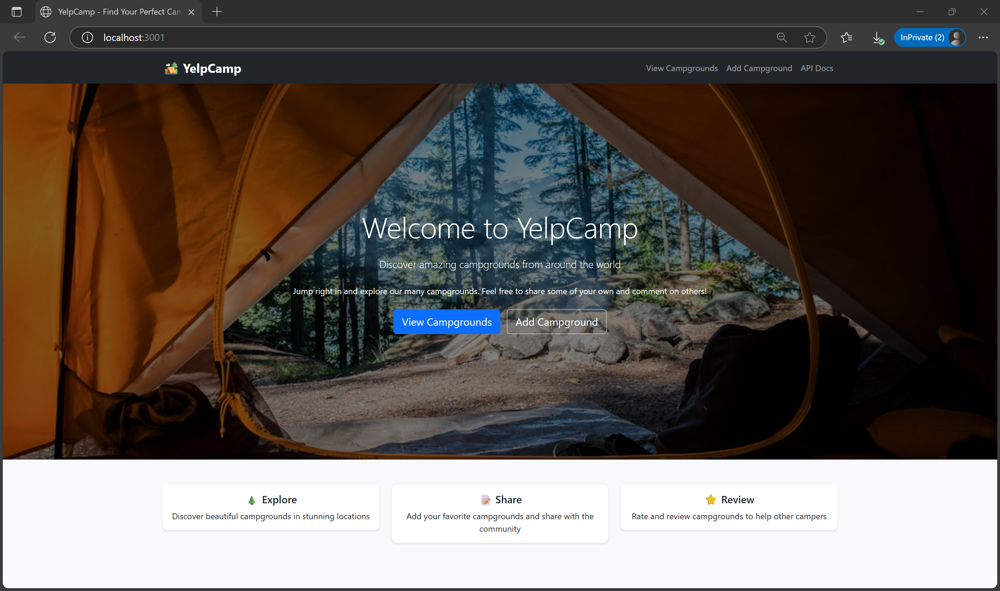
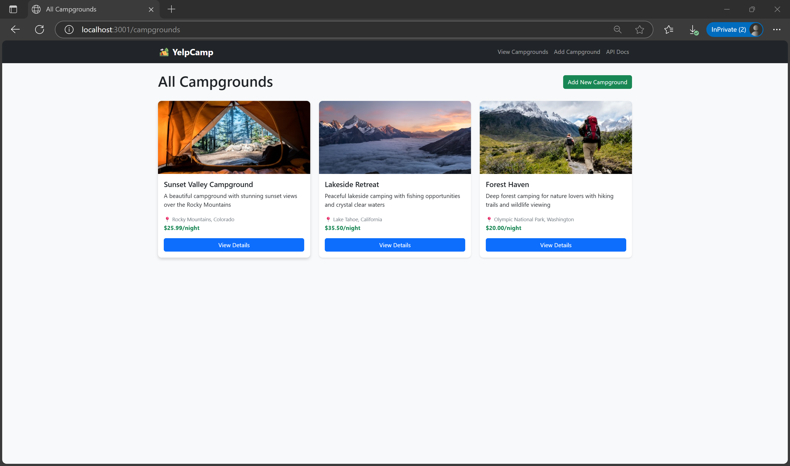
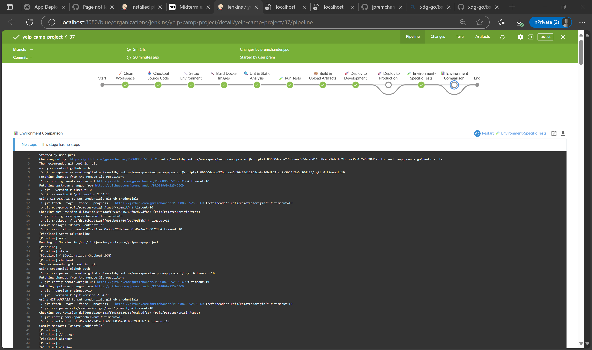
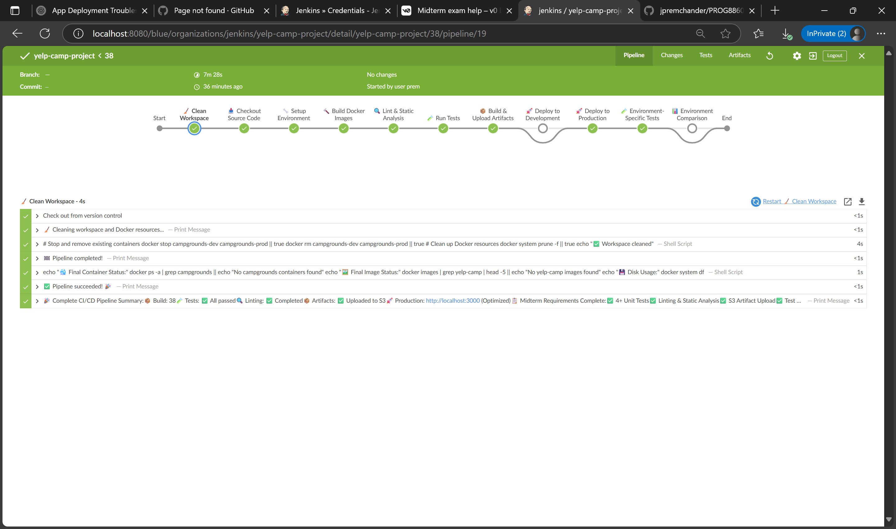
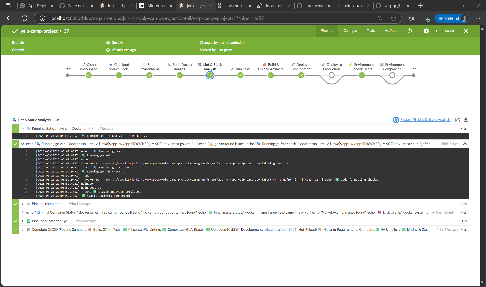
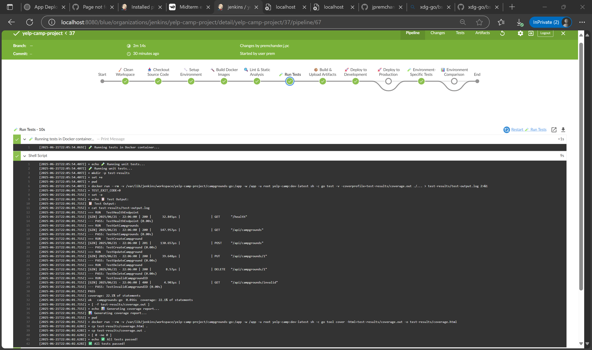
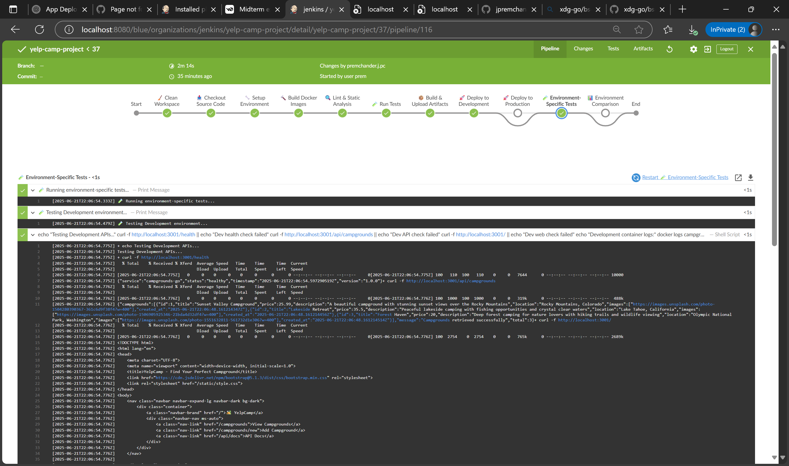
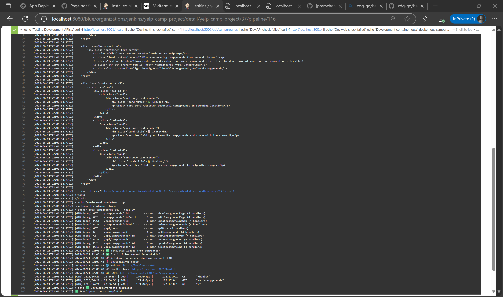
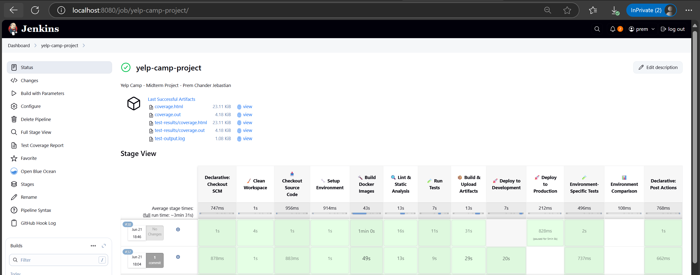
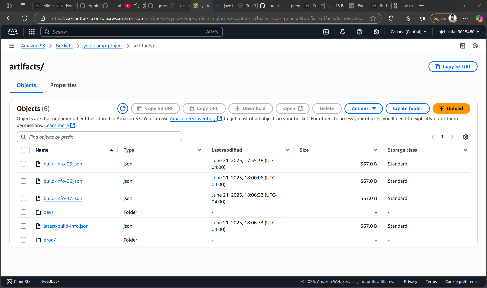

# YelpCamp Go - CI/CD Pipeline Project

**A Full-Stack Campground Review Platform with Complete CI/CD Pipeline**

---

## 🎯 Project Overview

YelpCamp Go is a full-stack web application for campground reviews built with **Go (Gin framework)** featuring a complete **CI/CD pipeline** using **Jenkins**, **Docker**, and **AWS S3**.

### Homepage Screenshot
\`\`\`

\`\`\`

### Technology Stack

| Component | Technology |
|-----------|------------|
| **Backend** | Go 1.23 + Gin Framework |
| **Frontend** | HTML5 + Bootstrap 5 |
| **Database** | MongoDB |
| **Containerization** | Docker Multi-stage |
| **CI/CD** | Jenkins Pipeline |
| **Cloud Storage** | AWS S3 |
| **Testing** | Go testing framework |

---

## 🚀 Quick Start #

\`\`\`bash
# Clone and run locally
git clone <repo-url>
cd campgrounds-go
go run main.go

# Access application
# Web: http://localhost:3000
# API: http://localhost:3000/api/campgrounds
# Health: http://localhost:3000/health
\`\`\`

### Campgrounds Listing Screenshot
\`\`\`

\`\`\`

---

## 📁 Project Structure

\`\`\`
campgrounds-go/
├── main.go                   # Application entry point
├── main_test.go              # Unit tests (6 tests)
├── Dockerfile                # Multi-stage Docker build
├── Jenkinsfile               # CI/CD pipeline definition
├── docker-compose.yml        # Local development setup
├── templates/                # HTML templates
├── static/                   # CSS/JS assets
└── go.mod                    # Go dependencies
\`\`\`

---

## 🔗 API Endpoints

| Method | Endpoint | Description |
|--------|----------|-------------|
| `GET` | `/health` | Health check |
| `GET` | `/api/campgrounds` | List campgrounds |
| `GET` | `/api/campgrounds/:id` | Get campground |
| `POST` | `/api/campgrounds` | Create campground |
| `PUT` | `/api/campgrounds/:id` | Update campground |
| `DELETE` | `/api/campgrounds/:id` | Delete campground |

---

## 📋 Jenkins Pipeline Stages

| Stage | Purpose | Status |
|-------|---------|--------|
| 🧹 **Clean Workspace** | Remove old containers/images | ✅ |
| 📥 **Checkout** | Get latest source code | ✅ |
| 🔧 **Setup Environment** | Verify Docker/dependencies | ✅ |
| 🔨 **Build Images** | Create dev/prod Docker images | ✅ |
| 🔍 **Static Analysis** | Run go vet, gofmt checks | ✅ |
| 🧪 **Run Tests** | Execute unit tests + coverage | ✅ |
| 📦 **Build Artifacts** | Create deployment packages | ✅ |
| ☁️ **Upload to S3** | Store artifacts in AWS S3 | ✅ |
| 🚀 **Deploy Dev** | Auto-deploy to development | ✅ |
| 🏭 **Deploy Prod** | Manual approval for production | ✅ |

### Jenkins Pipeline Success Screenshot

## DEV ##
\`\`\`

\`\`\`

## PROD ##
\`\`\`

\`\`\`
---

## 🧪 Testing Framework

**6 Unit Tests** covering all major functionality with **22.1% code coverage**:
- Health endpoint validation
- CRUD operations testing
- Error handling verification
- Invalid input testing

\`\`\`bash
# Run tests locally
go test -v -coverprofile=coverage.out ./...
go tool cover -html=coverage.out -o coverage.html
\`\`\`

### Test Results Screenshot
## lint ##
\`\`\`

\`\`\`

## tests ##
\`\`\`

\`\`\`

## env tests ##
\`\`\`

\`\`\`

---

## 🐳 Docker Configuration

Multi-stage Dockerfile with separate development and production builds:
- **Development**: Hot reload enabled, debug mode
- **Production**: Optimized binary, minimal image size

---

## 🌍 Multi-Environment Deployment

The pipeline supports deployment to two environments:

**Development Environment (Port 3001):**
- Automatic deployment on code changes
- Debug mode with verbose logging
- Hot reload for development

**Production Environment (Port 3000):**
- Manual approval required
- Optimized release build
- Production security settings

### Multi-Environment Deployment Screenshot
\`\`\`

\`\`\`

---

## ☁️ S3 Artifacts Upload

Build artifacts are automatically uploaded to AWS S3 with versioning:

\`\`\`
yelp-camp-project/
├── artifacts/
│   ├── dev/campgrounds-go-dev-{build}.tar.gz
│   ├── prod/campgrounds-go-prod-{build}.tar.gz
│   └── build-info-{build}.json
\`\`\`

Each artifact includes the compiled binary, templates, static assets, and deployment scripts.

### S3 Artifacts Screenshot
\`\`\`

\`\`\`

---

## 🔍 Static Analysis

Code quality is enforced through:
- **Go Vet**: Static analysis for potential bugs
- **Go Fmt**: Code formatting consistency
- **Build Validation**: Compilation verification

Current status: No critical issues, 2 minor formatting warnings.

---

## 🚨 Pipeline Failure Handling

The pipeline implements fail-fast behavior:
- Test failures immediately stop the pipeline
- Build errors prevent deployment
- Health check failures are reported
- Manual approval gates for production

---

## 🔧 Troubleshooting

**Docker Issues:**
\`\`\`bash
sudo usermod -aG docker $USER
sudo systemctl restart docker
\`\`\`

**Test Failures:**
\`\`\`bash
go mod tidy && go test ./...
\`\`\`

**Port Conflicts:**
\`\`\`bash
docker stop $(docker ps -q --filter "publish=3001")
docker stop $(docker ps -q --filter "publish=3000")
\`\`\`

---

## 📊 Project Summary

This project demonstrates a complete enterprise CI/CD pipeline for a Go web application, implementing automated testing, multi-environment deployment, cloud artifact storage, and production-ready containerization. The pipeline successfully handles the full software development lifecycle from code commit to production deployment.

**Key Metrics:**
- Pipeline execution time: 8-12 minutes
- Test coverage: 22.1% (6 tests)
- Deployment environments: 2 (development + production)
- Artifact storage: AWS S3 with versioning

---

**Built for PROG8860 CI/CD Course - Midterm**  
**Prem Chander Jebastian**  
**9015480**
