# 🛠️ PROG8860 Assignment – CI/CD Pipeline with AWS CDK

## 📌 Student Details

- **Name:** Premchander J
- **Student ID:** 9015480
- **Course:** PROG8860 – CI/CD
- **Submission Date:** 13-July-2025

---

## 📦 Project Overview

This project demonstrates a complete CI/CD pipeline using **AWS CDK** to deploy a simple serverless application. The application consists of:

- ✅ **AWS Lambda Function** – Handles requests with a basic Python handler
- ✅ **Amazon S3 Bucket** – Storage for any assets or files
- ✅ **Amazon DynamoDB Table** – Stores data with a primary key `id`
- ✅ **CodePipeline + CodeBuild** – Automatically deploys the infrastructure from GitHub on push

---

## 🚀 Tech Stack

| Layer          | Tool/Service        |
|----------------|---------------------|
| Version Control | GitHub              |
| CI/CD Pipeline | AWS CodePipeline     |
| Build Tool     | AWS CodeBuild        |
| IaC            | AWS CDK (Python)     |
| Cloud Services | AWS Lambda, S3, DynamoDB, IAM |

---

## 📂 Project Structure

PROG8860-S25-CICD/
│
├── app.py # Entry point (Lambda function)
├── buildspec.yml # CodeBuild instructions
├── requirements.txt # CDK dependencies
├── cdk.json # CDK app configuration
├── cdk_project_9015480/ # CDK Stack code
│ ├── cdk_project_9015480_stack.py
│ ├── init.py
│ ├── README.md
│ ├── requirements-dev.txt
│ ├── source.bat
│ └── tests/
└── .venv/ # (optional) Local virtual environment

yaml
Copy
Edit

---

## ⚙️ How It Works

### ✅ Step 1: GitHub Push

Whenever you push to the GitHub repository, it triggers:

### ✅ Step 2: AWS CodePipeline

- Pulls source from GitHub
- Runs **AWS CodeBuild** using `buildspec.yml`

### ✅ Step 3: CodeBuild

- Installs CDK and Python dependencies
- Runs `cdk synth` and `cdk deploy`
- Provisions:
  - Lambda
  - S3 bucket
  - DynamoDB table

---

## 🖥️ Screenshots (Add Your Own)

> 📸 Please insert the following screenshots below:

1. **Cloudformation Stack**
   > 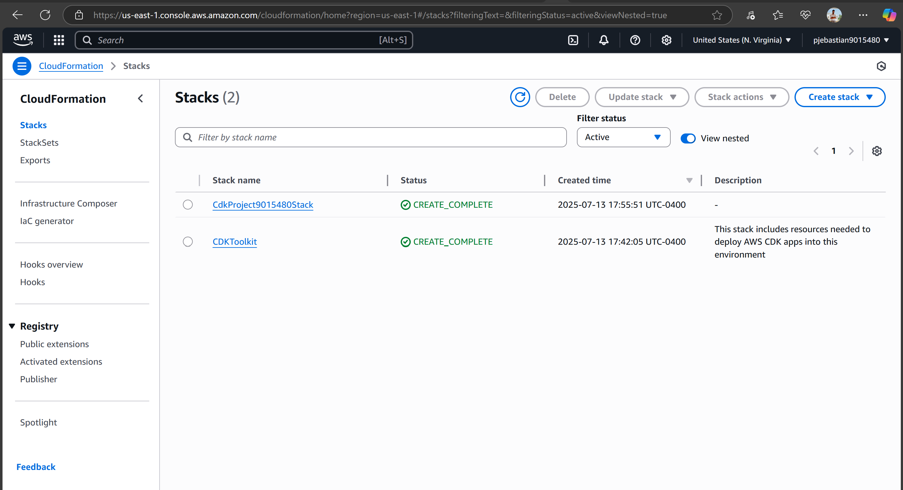

2. **AWS CodePipeline Execution**
   > 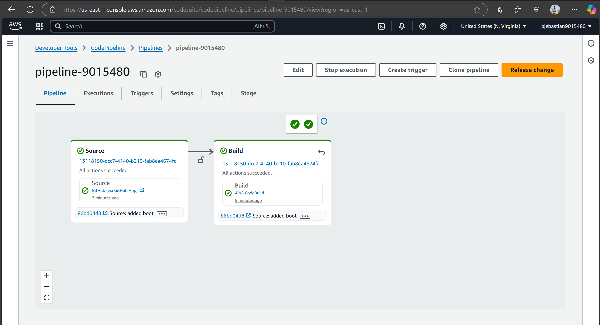

3. **CodeBuild Log Output (Success)**
   > 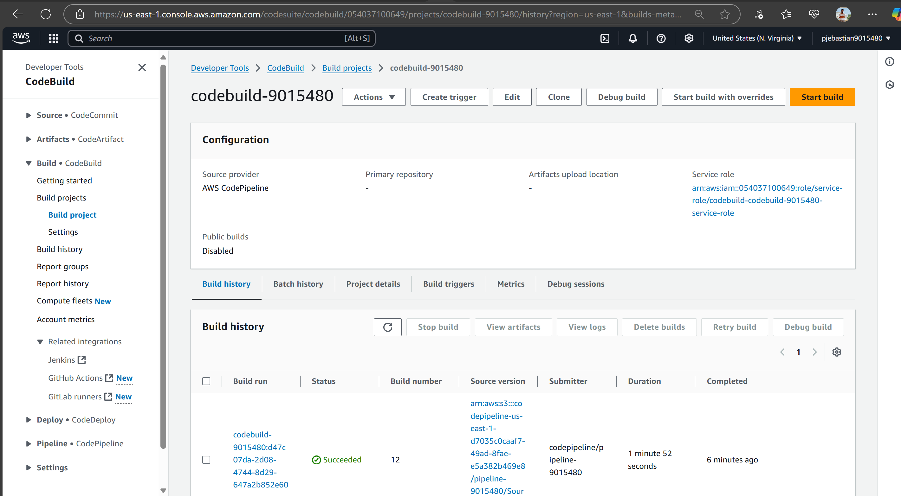
   > 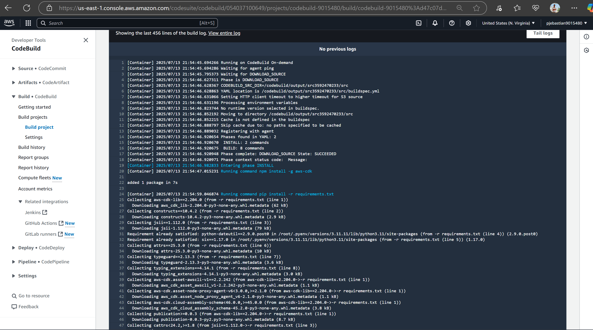
   > 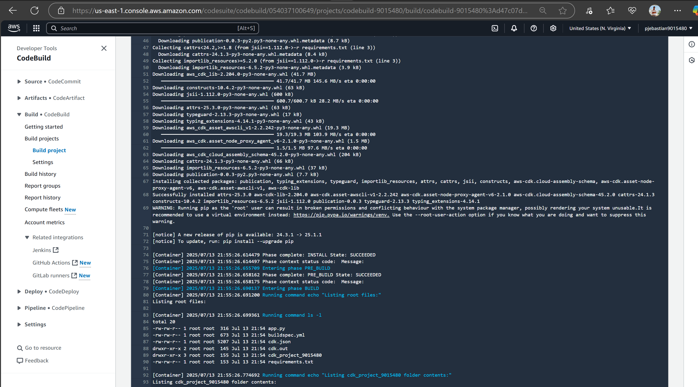
   > 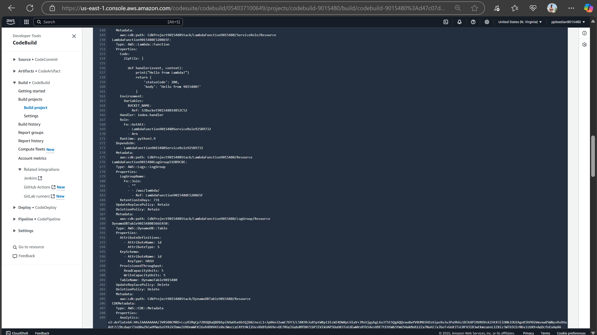
   > 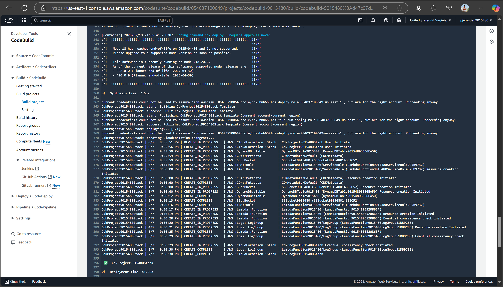
   > 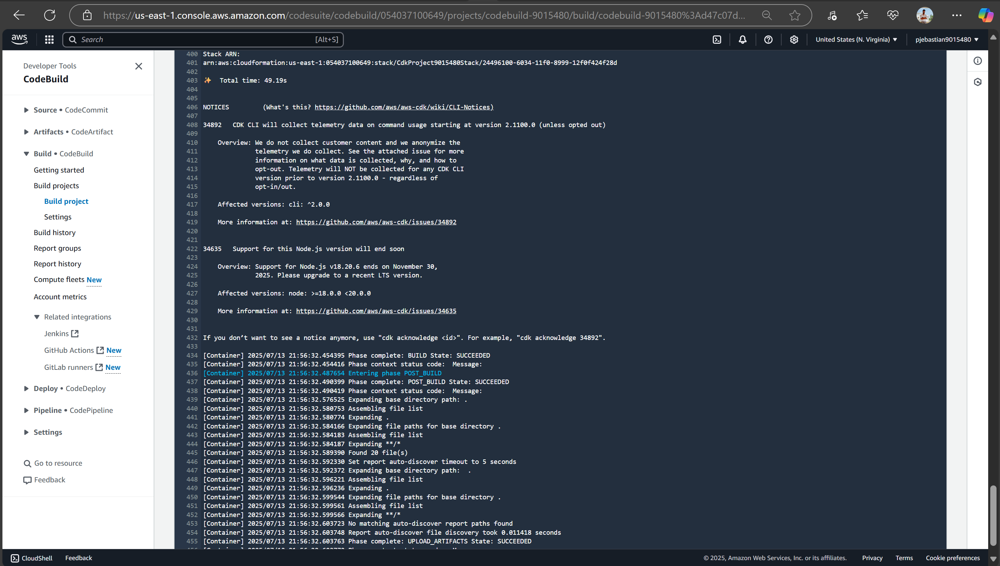

4. **AWS Lambda Console**
   > 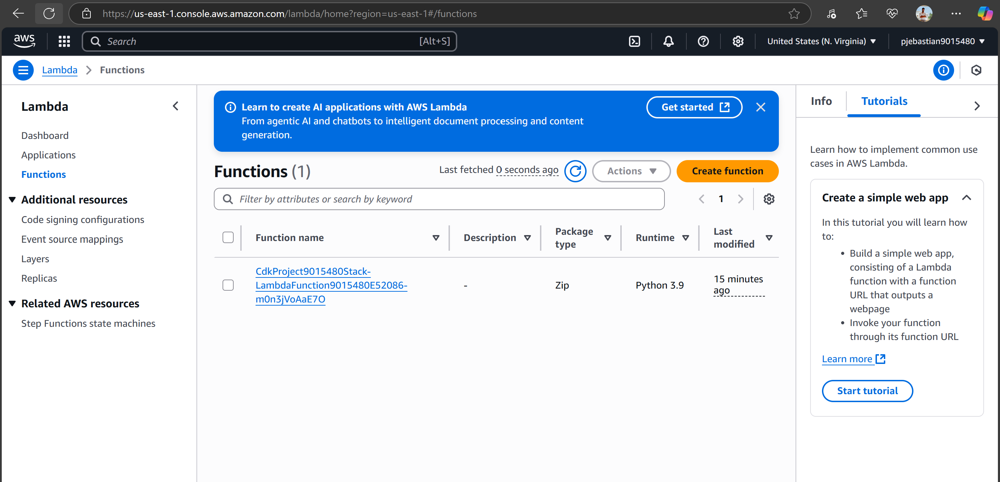

5. **DynamoDB Table**
   > 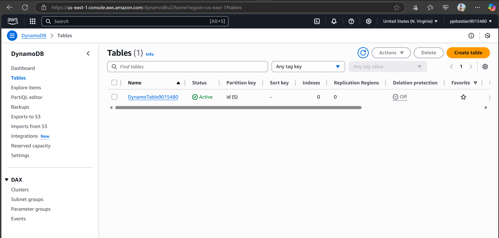

6. **S3 Bucket**
   > 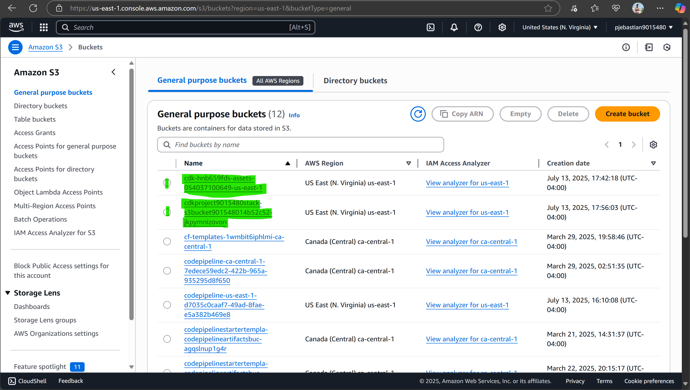

---

## ✅ CDK Stack Summary

The following AWS resources were deployed via CDK:

| Resource         | Type           | Notes |
|------------------|----------------|-------|
| `LambdaFunction` | AWS::Lambda::Function | Prints "Hello from 9015480!" |
| `S3Bucket`       | AWS::S3::Bucket        | Versioning enabled |
| `DynamoDBTable`  | AWS::DynamoDB::Table   | With `id` as primary key |
| `IAM Role`       | AWS::IAM::Role         | Lambda execution role |
| `Log Group`      | AWS::Logs::LogGroup    | For Lambda logs |

---

## 💵 Cost Optimization

This project runs entirely within **AWS Free Tier**:
- ✅ Lambda: < 1 million requests/month
- ✅ S3: < 5 GB storage
- ✅ DynamoDB: Up to 25 RCUs/WCUs
- ✅ CodePipeline + CodeBuild: Free for 1,000 minutes/month

---

## 🔐 Security Notes

- Environment is bootstrapped using `cdk bootstrap`
- Least privilege IAM roles used for Lambda
- All resources deleted after testing to prevent charges

---

## 📎 References

- [AWS CDK Docs](https://docs.aws.amazon.com/cdk/latest/guide/home.html)
- [AWS Free Tier](https://aws.amazon.com/free)
- [AWS CodePipeline](https://docs.aws.amazon.com/codepipeline/latest/userguide/welcome.html)
